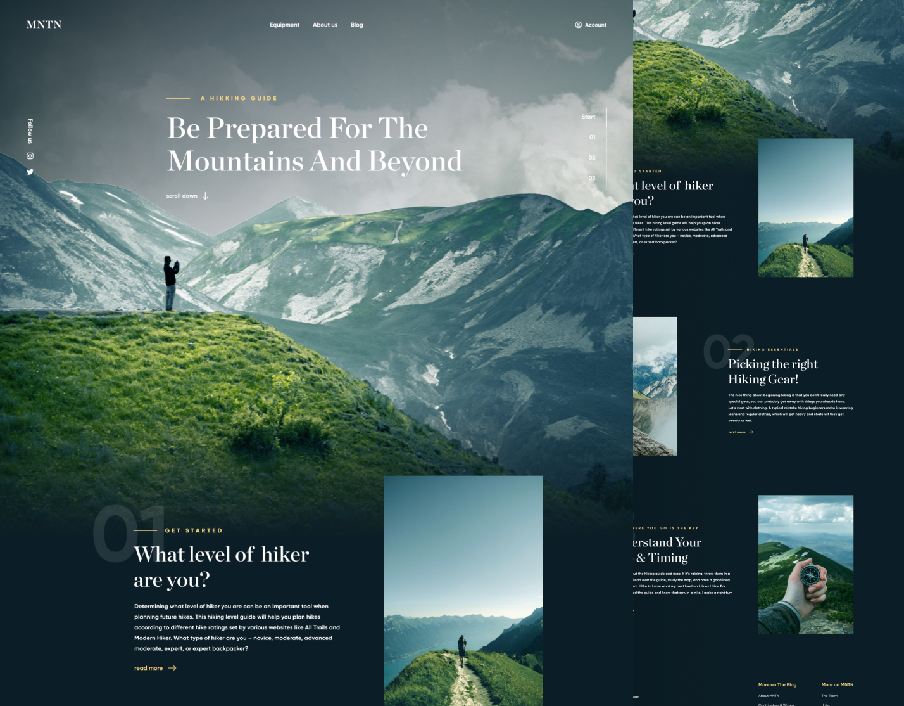

# MNTN - mountain hiking guide

## 🚀 Project Overview

This is study project, focused on improving layout, TypeScript skills. I am also focused on practicing in-depth work with Git and GitHub. The project aims to follow the [GitFlow](https://www.atlassian.com/git/tutorials/comparing-workflows/gitflow-workflow) workflow for development.

## 🎯 Key JS tasks & Solutions

- **Custom Modal (Accessibility & Semantics):**
  - **Problem:** native `<dialog>` element is not usable for this case because I don't want to duplicate html layout. I have not use `<dialog>` element because it always displayed with dialog role, witch is not correct on desktop' screens, where element becomes always visible container
  - **Solution:** Built a **custom modal** with manual focus trapping and a11y handling to ensure correct semantics across all screen sizes. `menu.ts`
- **Parallax effect for hero main image**
  - **Solution:** Made this with TypeScript using "scroll" event listener (`heroParallax.ts`)
- **Section indicator element:** display section that is closest to the center of the ViewPort
  - **Solution:** Made this with TypeScript using IntersectionObserver API for the best optimization `scrollIndicator.ts`
- **Fixed header with appearing blur effect**
  - **Solution:** Made it with "scroll" event listener `headerScroll.ts`

## 🛠️ Technology Stack

- HTML
- SCSS
- TypeScript
- Vite
- vite-plugin-image-optimizer

## ✅ Result and Figma layout

https://www.figma.com/community/file/788675347108478517

https://mntn-hike.vercel.app/
